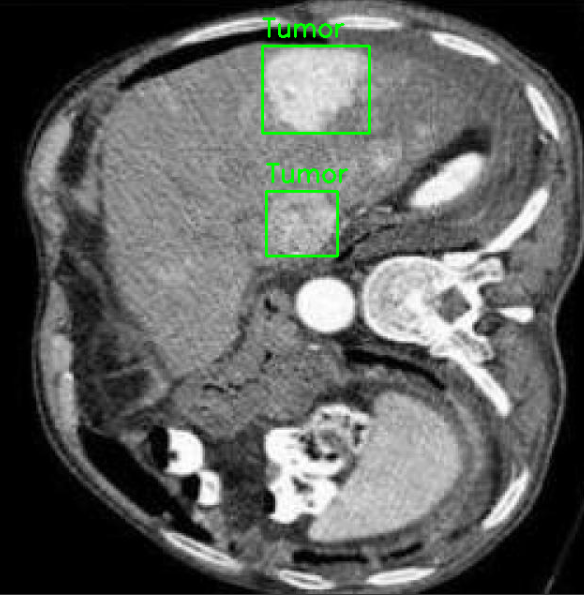
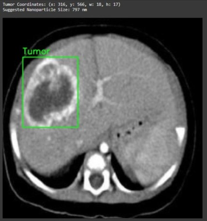

#  Liver Tumor Detection & Nanoparticles Mapping

This project detects liver tumors from MRI scans using YOLOv8 and recommends optimal nanoparticle sizes for targeted drug delivery. It combines medical image detection with Nanotechnology for improved cancer treatment planning.

## 📌 Features

-  Real-time liver tumor detection using YOLOv8n  
-  Automatic ROI (Region of Interest) cropping  
-  Tumor segmentation
-  Feature extraction
-  Tumor-to-nanoparticle mapping using predefined size rules  
-  High precision & accuracy metrics  
-  Visual result generation  

##  Dataset

- 📁 MRI liver scans (custom dataset)  
- 🩻 Labeled with bounding boxes  
- 🏷️ Class: Tumor  
- 🔁 Preprocessed: auto-orientation, flipping, scaling (data augmentation)

##  Model Used

-  YOLOv8n: For real-time liver tumor detection via bounding boxes

## 📈 YOLOv8n Detection Results

| Metric        | Value   |
|---------------|---------|
| Precision     | 99.7%   |
| Recall        | 98.6%   |
| mAP@0.5       | 99.5%   |
| mAP@0.5:0.95  | 91.9%   |

##  Sample Results

### 🔹 Detection Output (YOLOv8)

### 🔹 Final Mapping Output

## 🚀 Technologies Used

- 🐍 Python  
- ⚙️ YOLOv8 (Ultralytics)  
- 🧠 OpenCV  
- 📊 NumPy, Pandas  
- 📉 Matplotlib  

👉 [Download from Google Drive] (https://drive.google.com/file/d/1NF2-_nZNyLbijVvbC8haKHziHWkakm9j/view?usp=sharing)
